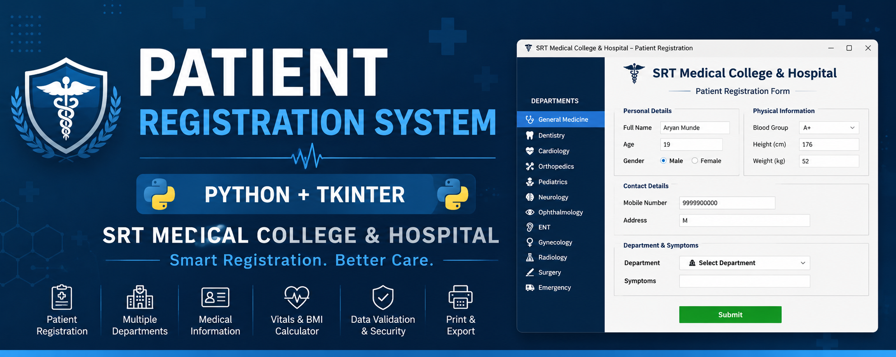
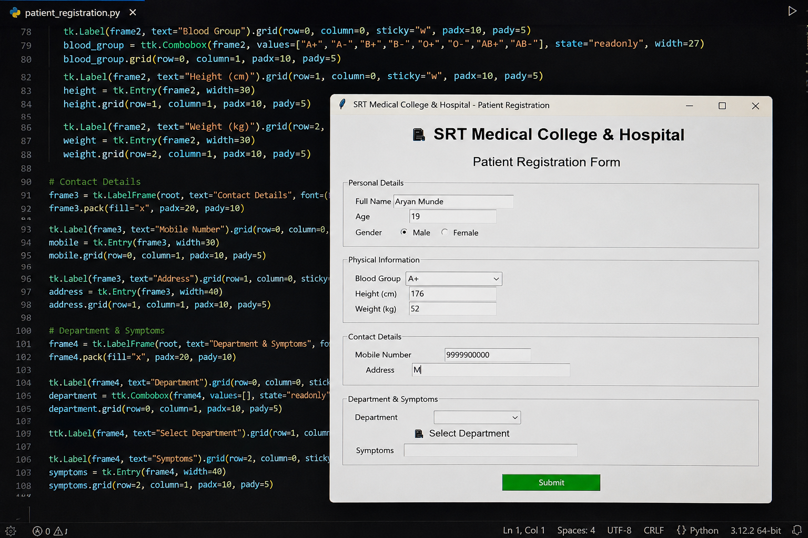
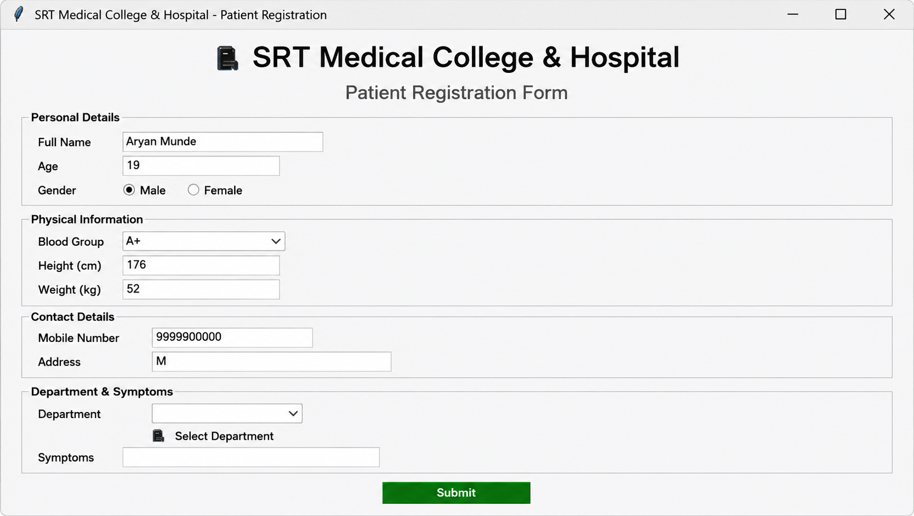

#Patient Registration System
### SRT Medical College & Hospital, Ambajogai

A desktop-based patient registration application built with Python and Tkinter.  
Developed as a practical Python GUI project during BTech (AI) - First Year.

---

## Features

- 12 hospital departments with dynamic color theming (Dentistry, Cardiology, Neurology, etc.)
- Auto-generated Patient ID based on timestamp
- BMI calculator that updates in real time as height and weight are typed
- 6 detailed sections: Personal Info, Medical Info, Contact Details, Emergency Contact, Vitals, and Insurance
- Form validation with Indian mobile number check
- Consent checkboxes for treatment, data use, and photography
- Clear form and Print buttons

## Sections Covered

| Section | Fields |
|---|---|
| Personal Info | Name, DOB, Age, Gender, Blood Group, Height, Weight, BMI, Aadhaar, PAN |
| Medical Info | Department, Doctor, Complaint, Allergies, Medications, Surgeries, Lifestyle |
| Contact Details | Mobile, Email, Full Address with Taluka/District/Pincode/State |
| Emergency Contact | Name, Relationship, Mobile, Address |
| Visit and Vitals | Temperature, BP, Pulse, SpO2, Referral, Ward |
| Insurance | Provider, ABHA Number, Scheme, Payment Mode, Consent |

## Screenshots

> Running application with VS Code



> Clean application window



## Requirements

- Python 3.x
- Tkinter (built-in with Python, no separate install needed)

## How to Run

```bash
git clone https://github.com/rushiprasadkanade/patient-registration-system
cd patient-registration-system
python patient_registration.py
```

## Tech Stack

- Python 3
- Tkinter (GUI)
- ttk (themed widgets)
- datetime, re (standard library)

## About

Built for SRT Medical College and Hospital, Ambajogai, Beed District, Maharashtra.  
Recognised by faculty and shared with the college cohort as an example of applied Python development.

---

*Rushiprasad Kanade — BTech AI, First Year*
